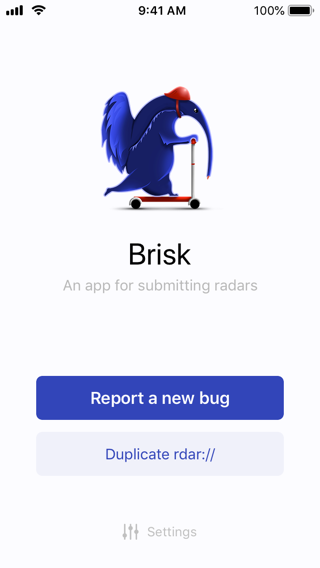

# Brisk

[](https://buildkite.com/florianbuerger/brisk)

Brisk is an iOS universal app for filing [Radars](http://radar.apple.com/) and crossposting them to [Open Radar](http://www.openradar.me/).

Brisk is written in Swift 4.0 and uses [Sonar](https://github.com/br1sk/Sonar) to communicate with Apple's Radar web “APIs”.




## Missing Features & known issues

**Works best if you enter you Apple ID and a valid OpenRadar token on first launch**.

Currently, the iOS version does not support:

- [ ] Attachments
- [ ] Saving radars as drafts

Posting a radar will fail when you did not enter valid login credentials for Apple's Bug Reporter.

Posting to OpenRadar only works when you entered your API key in settings. Re-entering your Apple ID and a new OpenRadar API token only works when you log out. Then you have to re-enter everything.

## URL Scheme

Brisk supports an URL scheme `brisk-rdar` to integrate with other apps.

Pass an OpenRadar number: `brisk-rdar://radar/123456`. Per default, Brisk searches for the number with user interaction. If you don't want that, use `brisk-radar://radar/123456?submit=false`.

## Installation

iOS apps have to be signed in order to be installed on a device. To let Xcode handle everything for you change the `Bundle Identifier` to something unique, `com.<yourname>.brisk` for example and select your development team in Xcode.

1. Open `Brisk iOS.xcworkspace`
2. Go to Xcode > Preferences > Accounts and add an active iOS developer account if you haven't done that already
3. Change the `Bundle identifier` to `com.<yourname>.brisk`
4. Select the project in Xcode's sidebar, select the `Brisk iOS` target and select your Apple ID in `Signing > Team`

Feel free to [contact me](mailto:hi@florianbuerger.com) if you need help or open a new issue.

## Development

The app is built with Swift 4 using Xcode 9. It requires [swiftlint](https://github.com/realm/SwiftLint) to be installed in your `$PATH`. If you haven't yet, please install it using [Homebrew](https://brew.sh/):

```
$ brew install swiftlint
```

## Credits

Thanks to [keith](https://github.com/keith) for the work on [Sonar](https://github.com/br1sk/Sonar) and the [macOS app](https://github.com/br1sk/brisk).
